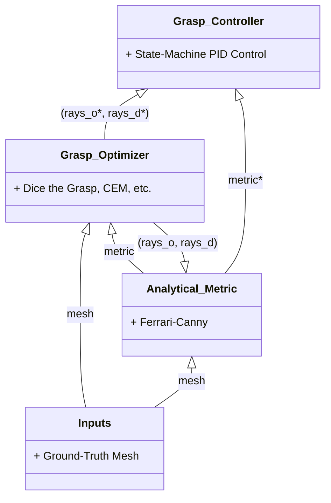
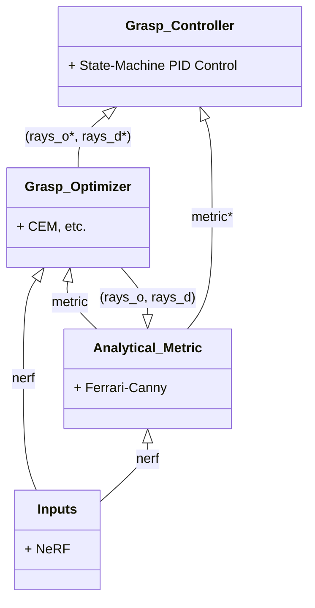
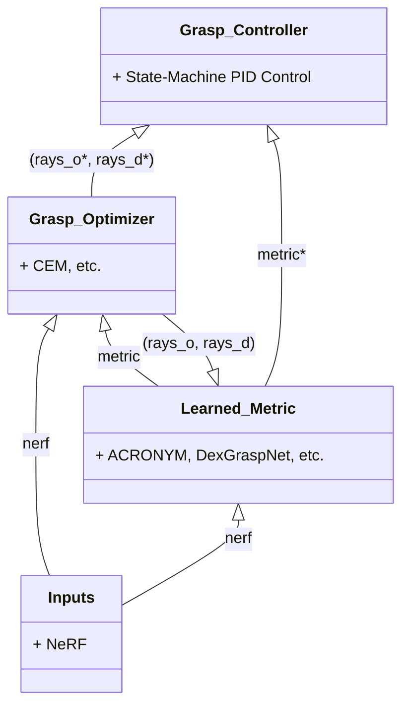
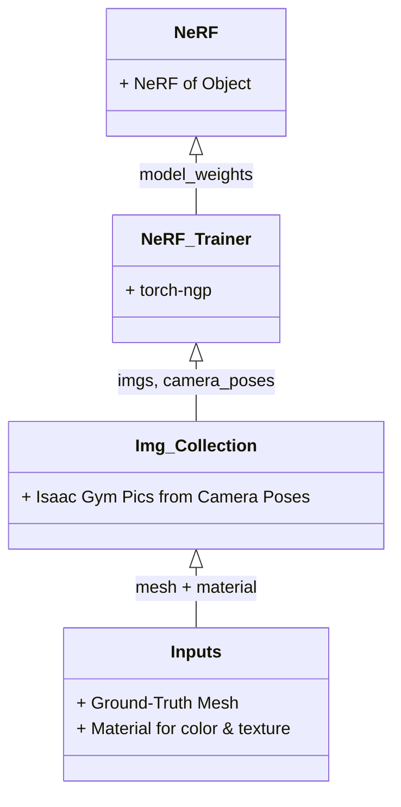

# Grasping with NeRFs

This project focuses on performing grasping and manipulation using
Neural Radiance Fields (NeRFs).

# Grasping Pipeline

## Mesh FC Pipeline



## NeRF FC Pipeline



## NeRF + Learned Metric Pipeline



Additional ablation studies: use ground-truth mesh and NeRF as inputs, use one of each for sampling or metric.

# Learned Metric Training Pipeline


# NeRF Training Pipeline



### Setup

#### Python Installation
To install, first clone this repo, using
```
git clone --recurse-submodules https://github.com/pculbertson/nerf_grasping
```
then follow the instructions [here](https://github.com/stanford-iprl-lab/nerf_shared/)
to install the `nerf_shared` python package and its dependencies.

Note: I made `nerf_shared` a submodule since it's still less-than-stable, and it
might be nice to still edit the package / push commits to the `nerf_shared` repo.

Finally, install this package's dependencies by running
```
pip install -r requirements.txt
```
(If running on google cloud, install using `pip install -r gcloud-requirements.txt`)

#### Data Setup

The current experiment notebook uses some data generated by Adam using Blender.
You can request access to both the training data and a trained model from him.

Once you have access to the data, copy the following files:

1. Copy all of the checkpoint files in `nerf_checkpoints/*` to `torch-ngp/data/logs`.

2. From the `nerf_training_data` folder on Google Drive, copy the directory
`blender_datasets/teddy_bear_dataset/teddy_bear` into
`nerf_grasping/nerf_shared/data/nerf_synthetic/teddy_bear`.

This should be all you need to run the example notebook!

#### Other Setup

An important note: you need to have Blender installed to run the mesh union/intersection
operations required to compute the mesh IoU metric. You can do this per the instructions [here](https://docs.blender.org/manual/en/latest/getting_started/installing/linux.html).

### References

The trifinger robot URDF, and some enviroment setup code is from [https://github.com/pairlab/leibnizgym](https://github.com/pairlab/leibnizgym)
