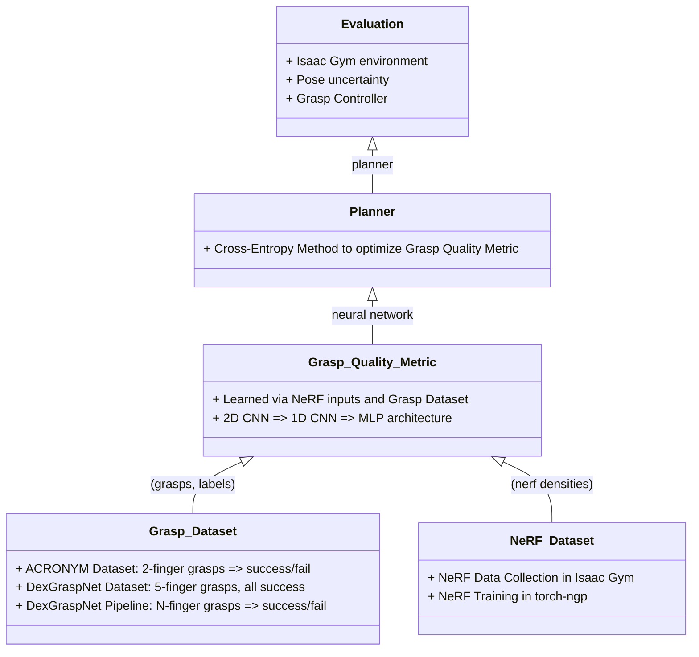
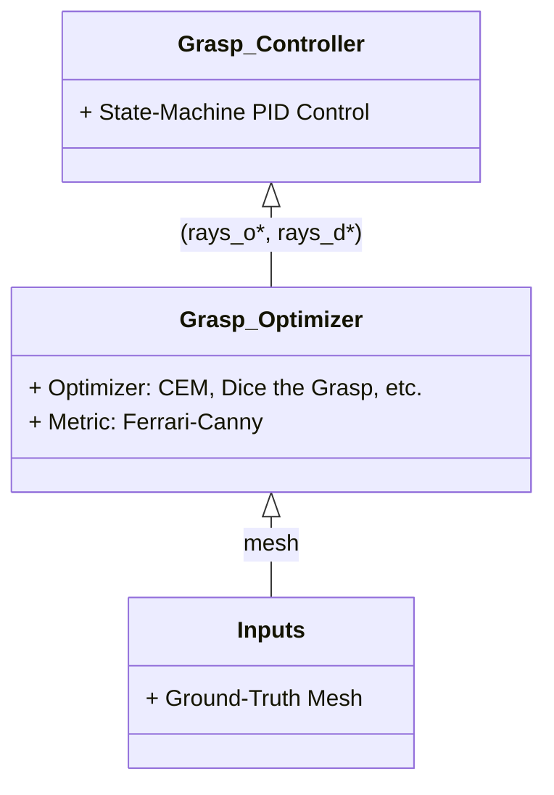
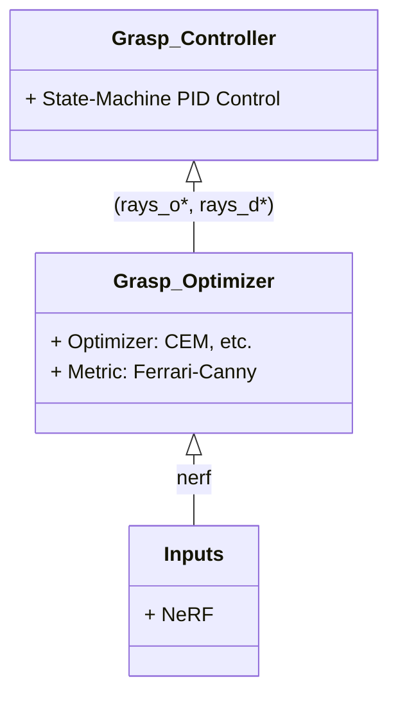
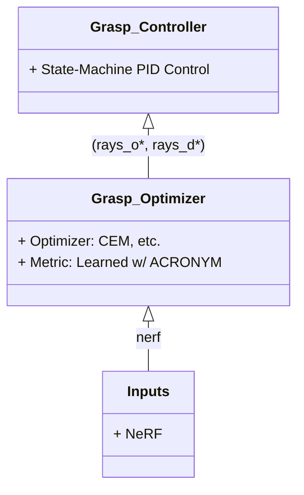
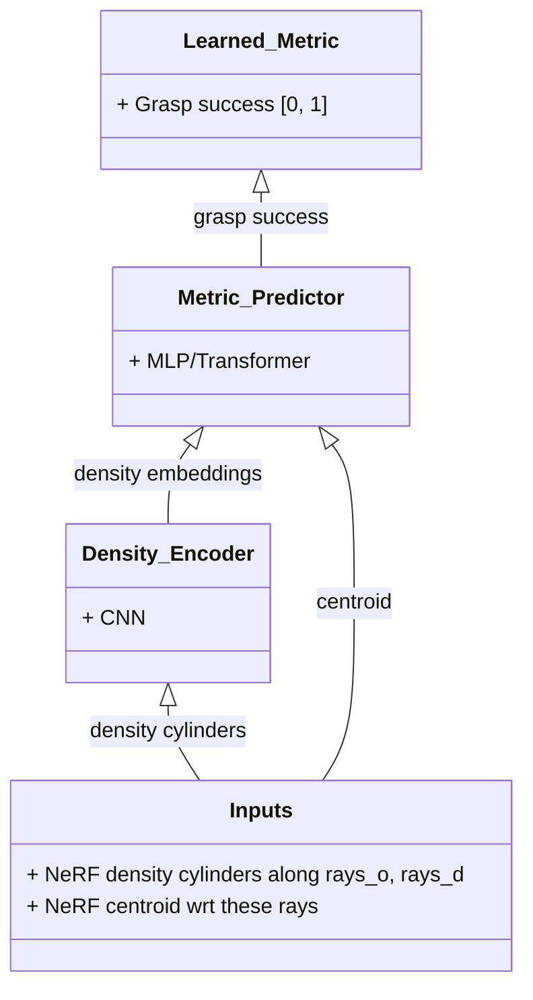
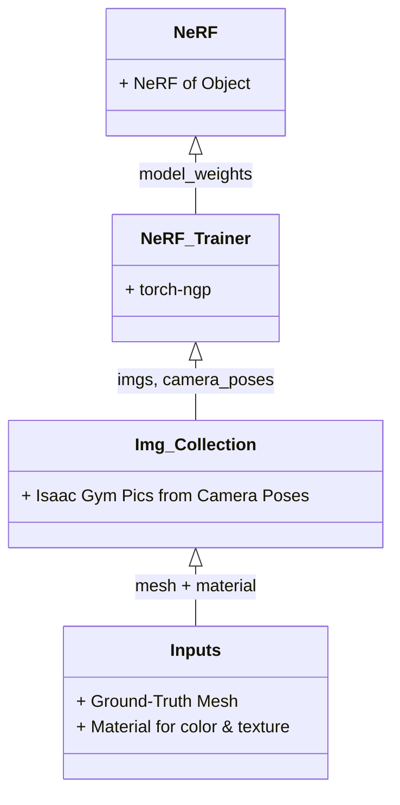

# System Diagram

## High-Level

# Grasping Pipeline

## Mesh + Ferrari-Canny Pipeline

## NeRF + Ferrari-Canny Pipeline

## NeRF + Learned Metric Pipeline

Additional ablation studies: use ground-truth mesh and NeRF as inputs, use one of each for sampling or metric.

# Learned Metric Network Architecture

# NeRF Training Pipeline

